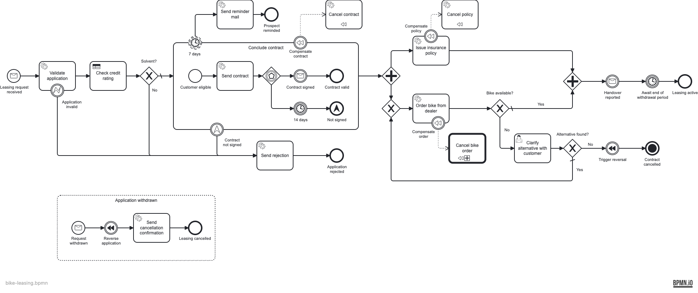

# Operaton Bike-Leasing Blueprint

A ready-to-fork **starting point** for automating a business process on
[Operaton](https://operaton.org) (the community-driven fork of Camunda 7) with an **embedded engine**,
Spring Boot and Kotlin — one complete, runnable, production-shaped BPMN service you can clone and make
your own.

## The scenario

Meet **MiraVelo** — a (fictional) lifestyle bike brand for the quarter-life-crisis crowd: gravel bikes
for the weekends that count, road bikes for everyone who just wants to feel the asphalt. MiraVelo sells
its bikes on a **leasing model** for private and corporate customers, and this project automates that
leasing application from the first request to an active lease.

It's a made-up company, so nobody gets hurt when the DMN politely declines a 15-year-old's application
for a carbon road bike.

## What's inside

Most engine examples stop at a happy-path service task. This one deliberately walks through the **broad
palette of BPMN elements you actually meet in real processes** — and the engineering scaffolding around
them — so a new project starts from something complete instead of a blank page:



- a **message start event**, **service tasks** (JavaDelegates) and a **DMN business-rule task**;
- an **embedded sub-process** with an **event-based gateway** (sign vs. a 14-day deadline) and a
  non-interrupting **7-day reminder timer**;
- a **parallel fork/join**, and a **user task with a Camunda Form** — completable in the Tasklist *or*
  via a REST endpoint;
- an **execution listener** on a service task and a **task listener** on the user task — the two
  common listener hooks, wired as Spring beans just like the delegates;
- **compensation / SAGA** handlers guarded by **error** and **escalation** boundary events;
- a **call activity** into a second process, a **message event sub-process** (application withdrawal),
  and a **terminate end event**.

## How it's built

```
service/
  common-architecture-tests/   reusable ArchUnit + Konsist rule suite (src/main)
  app/                         the Operaton bike-leasing service (hexagonal)
    adapter/inbound/rest        domain REST controllers
    adapter/inbound/operaton    JavaDelegates for the BPMN service tasks
    adapter/outbound/operaton   drives the engine (RuntimeService / TaskService)
    adapter/outbound/db         JPA persistence (leasing applications + bike portfolio)
    adapter/outbound/dealer     simulated bike dealer (stock check + order)
    adapter/process             generated *ProcessApi (bpmn-to-code) + engine config
    application/{port,service}  use-case ports and their services
    domain/{leasing,bike}       pure domain model
    resources/{bpmn,dmn,forms}  the process models and Camunda Forms
bruno/                         REST scenarios (happy-path / escalation / abort / not-solvent / …)
tools/                         BPMN linting (bpmnlint)
stack/                         Postgres dev stack (docker compose)
.github/                       pre-merge pipeline + Dependabot
```

- **Stack:** Kotlin 2.4 · Spring Boot 4 · Operaton 2.1 (embedded) · PostgreSQL · Gradle with a
  `libs.versions.toml` version catalog.
- **Generated process API:** the [`bpmn-to-code`](https://github.com/emaarco/bpmn-to-code) Gradle
  plugin turns each `.bpmn` into a typed `*ProcessApi` object, so element ids, messages, timers and
  variables are compile-checked constants used by both delegates and tests.
- **Forms:** Camunda Forms (`.form`) are deployed with the process and render in the Operaton
  Tasklist/Cockpit for the user tasks.
- **BPMN linting:** [`bpmnlint`](https://github.com/bpmn-io/bpmnlint) (`bpmnlint:recommended`) gates
  the `.bpmn` models in `tools/`, run in CI before the Gradle build.

## Design decisions

- **Hexagonal architecture** keeps the engine and framework at the edges: the domain and use cases
  never depend on Operaton, so business logic is testable and the engine is replaceable. The
  `:service:common-architecture-tests` module enforces this with **ArchUnit** (bytecode: layering,
  dependency direction, naming) and **Konsist** (source: one declaration per file, no wildcard
  imports) — one line wires it into a service: `class ArchitectureTest : ServiceArchitectureTest(...)`.
- **Unit tests** (JUnit 5 + MockK) cover every domain type, application service and adapter with
  given/when/then comments and shared `testLeasingApplication(...)` builders — controllers via
  `@WebMvcTest`, persistence via `@DataJpaTest`. JavaDelegates are covered by the process tests.
- **Process tests** (`operaton-bpm-assert`) drive the deployed model deterministically — timers and
  async continuations are fired and messages correlated by hand — covering happy-path, escalation,
  abort, DMN rejection, and the bike-unavailable → alternative-selection loop.
- **Model validation** (`bpmn-to-code-testing`) checks the `.bpmn` models structurally at build time
  (`BpmnRules.all()` plus a custom rule requiring every service task to use a delegate expression).
- **Bruno + CI** proves the same scenarios against the *running* app: domain REST endpoints drive the
  business actions, and the Operaton `/engine-rest` API completes user tasks and fires timer jobs so
  the whole flow runs in the pipeline without real 14-day waits.
- **Dependabot** keeps Gradle, the Postgres image and GitHub Actions current.

## Run it

```bash
# 1. start Postgres
docker compose -f stack/docker-compose.yml up -d

# 2. run the app (Operaton Cockpit/Tasklist at http://localhost:8080/operaton, admin/admin)
./gradlew :service:app:bootRun

# 3. lint the BPMN models
npm --prefix tools ci && npm --prefix tools run lint:bpmn

# 4. drive the scenarios (build + arch + process tests first, then the REST flows)
./gradlew build
cd bruno && npx @usebruno/cli run . --env local -r
```

Start a case with `POST http://localhost:8080/api/bike-leasing`
(`{ "customerName": …, "email": …, "age": 35, "monthlyNetIncome": 3500, "bikeId": "BIKE-900", "bikeModel": "Gravel Explorer 900" }`).

The `age` and `monthlyNetIncome` feed the `checkCreditRating` DMN; the `bikeId` identifies the bike and
is the *only* bike attribute the engine ever carries. The descriptive `bikeModel` lives in a separate
**bike portfolio** aggregate (its own `bike_portfolio` table, keyed by `bikeId`) — never as a process
variable — and `GET /api/bike-leasing/{id}` resolves it back from there.

If the requested bike is out of stock, the `Clarify alternative with customer` user task can be resolved
**two ways**, a deliberate contrast:

- the **recommended** path — a client calls `POST …/api/bike-leasing/{id}/clarify-alternative`, which
  routes through the domain (persisting the chosen alternative) *before* completing the task; versus
- the **form-only** path on `clarify-return` in `cancel-bike-order.bpmn`, kept as a counter-example:
  completing it via the Camunda Form or `/engine-rest` never touches the domain, so its data lands only
  in process variables (see the `bpmn:documentation` on each task).

Bike availability itself is decided by a `BikeDealerPort` outbound adapter (`checkAvailability` /
`order`) whose small out-of-stock deny-list drives the branch.

## Contributing

Contributions are welcome. Please open an issue to discuss substantial changes first, keep the
architecture tests green (`./gradlew build`), and use
[Conventional Commits](https://www.conventionalcommits.org) for commit messages and PR titles.

## License

Licensed under the [MIT License](./LICENSE).
